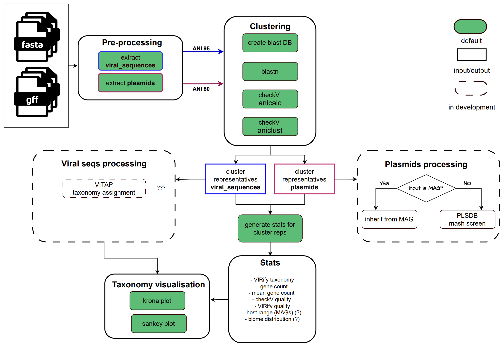

# metaViraVerse

A [MGnify](https://www.ebi.ac.uk/metagenomics) Nextflow pipeline for generating a **viral catalogue**.

## Overview

The pipeline takes previously predicted **viral sequences**, **prophages**, and **plasmids** as input and performs downstream analysis and annotation. Viral sequences and prophages are combined into a single **viruses** group, while plasmids are processed as a separate **plasmids** group.

**Viruses:**

- Quality assessment
- rRNA detection
- Clustering at 95% ANI identity
- Taxonomy assignment
- Host detection
- Lifestyle categorisation
- Protein prediction
- Protein annotation
- Protein clustering

**Plasmids:**

- Clustering at 85% ANI identity
- Host detection [in development]
- Prediction of replicon family, relaxase type, and mate-pair formation type [in development]

<p align="center">
    
</p>

> [!NOTE]
> This pipeline was originally written to build viral catalogues from [MGnify](https://www.ebi.ac.uk/metagenomics/) annotations, using results produced by [emg-viral-pipeline](https://github.com/EBI-Metagenomics/emg-viral-pipeline) (VIRify) and [mobilome-annotation-pipeline](https://github.com/EBI-Metagenomics/mobilome-annotation-pipeline) (MAP).
>
> If you don't have MGnify results, you can still run the pipeline using `--third_party_input`.

## Download databases

Check [documentation](docs/databases.md) how to download and prepare databases.

## Usage

- For MGnify input, see the [MGnify usage guide](docs/mgnify_usage.md).
- For third-party data, see the [third-party usage guide](docs/third_party_usage.md).
- Process mixed data specifying both `--input` and `--third_party_input`

## Methods

In detail pipeline description can be found in [methods](docs/methods.md).

## Run

Check the appropriate section in [MGnify](docs/mgnify_usage.md) and [third-party](docs/third_party_usage.md) usage guides.

Example,

```bash
nextflow run main.nf \
    -resume \
    -profile <appropriate profile> \
    -c <appropriate.config> \
    --outdir <OUTDIRNAME> \

    --input <MGnify samplesheet.csv [optional]> \
    --third_party_input <third party samplesheet.csv [optional]> \

    --catalogues_metadata <MGnify genomes-all_metadata.tsv [requred for MGnify data]> \
    --rename_accession <MGYV [optional, default: seq]> \
    --start_accession <first identifier number, e.g. 30. Used when renaming, e.g. >seq30 [optional]> \
    --end_accession <last identifier number, e.g. 40, used when renaming e.g. >seq40 [optional]> \

    --phammseqs <if you want to run protein clustering [optional, default: true]> \

    --skip_vitap [default: false] \
    --skip_genomad [default: false] \

    --skip_amrfinderplus [default: true] \
    --skip_deeparg [default: false] \
    --skip_rgi [default: false] \

    --skip_iphop [default: false] \

    --predict_host_from_custom_spacers <if custom CRISPR spacers were provided [optional]> \
    --custom_spacers_fasta PREFIX_crispr.fasta <if custom CRISPR spacers were provided [optional]> \
    --custom_spacers_metadata PREFIX_crispr.tsv <if custom CRISPR spacers were provided [optional]> \
```

## Outputs

Pipeline results are written to the specified `OUTDIRNAME`, following the structure described in the [output documentation](output.md).

## Citations

If you use this pipeline, please cite all software it uses from [CITATIONS](docs/citations.md)
